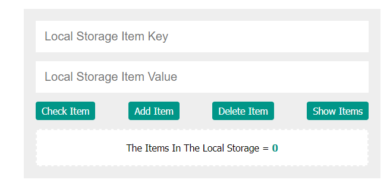

# Locale-Storage-Control

Work on local storage with a different function ( checking, adding, deleting and show all items )

By using HTML CSS and JS.

The whole project.

## Using Add button

To add key and value to the local storage
If any of input fields not have an input will display an error.

## The check button

Checking of the input from the local storage otherwise will display an error.

## The delete button

It will deleted the key that has been input and if the input value not found in the local storage it will display an error.

## The show items button

It will display all of the local storage items and the number of them.

Thanks To Complete
